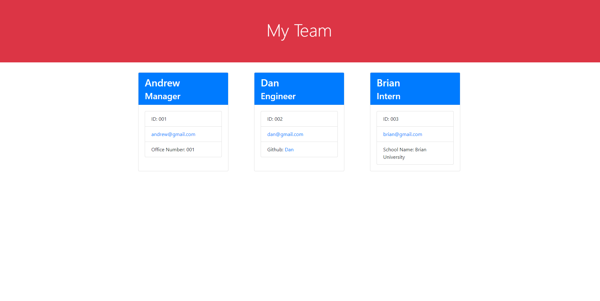

# team-profile-generator


## Description

The main purpose of this project is to create an application that allows the manager to view and update his or her team's information at a glance. In this application, the users will need to answer some questions that will reflect the team's information on a webpage.

You can find a video guide to the team-profile-generator [here](https://youtu.be/sMq3Lq8jOBY).

## Table of Contents

- [Installation](#installation)
- [Usage](#usage)
- [Tests](#tests)
- [Questions](#questions)
- [License](#license)
- [Credits](#credits)

## Installation

To run this application, you will first need to install inquirer after cloning this repository. Then, you will have to run the following code:

```
npm i
```

After that, the inquirer will be installed and the team-profile-generator will be ready to run.

In addition, jest will also be installed, which is needed to run the tests in the [Test](#tests) section.

## Usage

The users will need to run the following command in their terminals:

```
node index.js
```

After entering the command, the users will come across a series of questions to generate an index.html file located in the dist folder for easy access.

Please find a screenshot of the application at work and the result!


## Tests

There are 4 tests that the users use to see if each class's constructors, functions, and properties are working.

1. employee.js
2. manager.js
3. engineer.js
4. intern.js

To run the test, please run the following code:

```
npm test
```

The test will automatically run and update as you test different files.

[Here](https://youtu.be/bQ91F6O-pJw) is a video guide on how to run the test.

## Questions

If you have any questions, please feel free to reach me at:

- GitHub: Yahplee
- Email: [alee68@fordham.edu](mailto:alee@fordham.edu)

## License

This project is nested under the following license: MPL2.0

## Credits

Copyright © Yahplee All rights reserved.
